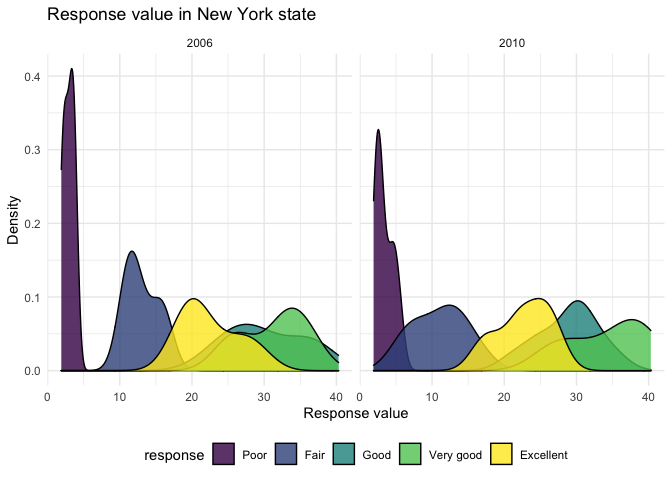

p8105\_hw3\_rz2570
================
Ruilian Zhang
10/12/2021

``` r
library(tidyverse)
```

    ## ── Attaching packages ─────────────────────────────────────── tidyverse 1.3.1 ──

    ## ✓ ggplot2 3.3.5     ✓ purrr   0.3.4
    ## ✓ tibble  3.1.4     ✓ dplyr   1.0.7
    ## ✓ tidyr   1.1.3     ✓ stringr 1.4.0
    ## ✓ readr   2.0.1     ✓ forcats 0.5.1

    ## ── Conflicts ────────────────────────────────────────── tidyverse_conflicts() ──
    ## x dplyr::filter() masks stats::filter()
    ## x dplyr::lag()    masks stats::lag()

``` r
library(p8105.datasets)

# Set plot options.

knitr::opts_chunk$set(
  fig.width = 6,
  fig.asp = .6,
  out.width = "90%"
)

theme_set(theme_minimal() + theme(legend.position = "bottom"))

options(
  ggplot2.continuous.colour = "viridis",
  ggplot2.continuous.fill = "viridis"
)

scale_colour_discrete = scale_colour_viridis_d
scale_fill_discrete = scale_fill_viridis_d
```

# Problem 1

``` r
# Import data and do some exploration.

data("instacart")

dim(instacart)
```

    ## [1] 1384617      15

``` r
names(instacart)
```

    ##  [1] "order_id"               "product_id"             "add_to_cart_order"     
    ##  [4] "reordered"              "user_id"                "eval_set"              
    ##  [7] "order_number"           "order_dow"              "order_hour_of_day"     
    ## [10] "days_since_prior_order" "product_name"           "aisle_id"              
    ## [13] "department_id"          "aisle"                  "department"

``` r
head(instacart) 
```

    ## # A tibble: 6 × 15
    ##   order_id product_id add_to_cart_order reordered user_id eval_set order_number
    ##      <int>      <int>             <int>     <int>   <int> <chr>           <int>
    ## 1        1      49302                 1         1  112108 train               4
    ## 2        1      11109                 2         1  112108 train               4
    ## 3        1      10246                 3         0  112108 train               4
    ## 4        1      49683                 4         0  112108 train               4
    ## 5        1      43633                 5         1  112108 train               4
    ## 6        1      13176                 6         0  112108 train               4
    ## # … with 8 more variables: order_dow <int>, order_hour_of_day <int>,
    ## #   days_since_prior_order <int>, product_name <chr>, aisle_id <int>,
    ## #   department_id <int>, aisle <chr>, department <chr>

-   The `instacart` dataframe has 15 of columns and 1384617 of
    observations. Each row contains relative information of an item from
    one order , which are: order\_id, product\_id, add\_to\_cart\_order,
    reordered, user\_id, eval\_set, order\_number, order\_dow,
    order\_hour\_of\_day, days\_since\_prior\_order, product\_name,
    aisle\_id, department\_id, aisle, department.  
-   For example, for product `49302`, its order of being added to cart
    was `1` by user `112108`, and it’s from `dairy eggs` department.

``` r
# How many aisles are there, and which aisles are the most items ordered from?

ins_aisle = instacart %>% 
  group_by(aisle) %>% 
  summarize(
    n_obs = n()) %>% 
  arrange(-n_obs)
```

-   There are 134 aisles, the `fresh vegetables` (`aisle_id` is 83)
    aisle is the most items are ordered from.

``` r
# Make a plot that shows the number of items ordered in each aisle, limiting this to aisles with more than 10000 items ordered.

ins_aisle %>% 
  filter(n_obs > 10000) %>% 
  mutate(aisle = forcats::fct_reorder(aisle, n_obs)) %>% 
  ggplot(aes(x = aisle, y = n_obs)) +
  geom_bar(stat = "identity", fill = "blue", alpha = .8) +
  coord_flip() +
  labs(
    title = "The number of items ordered in each aisle",
    x = "Aisle",
    y = "Number of items"
  )
```


``` r
# Make a table showing the three most popular items in each of the aisles “baking ingredients”, “dog food care”, and “packaged vegetables fruits”.

popular_items_table = instacart %>% 
  filter(aisle == c("baking ingredients", "dog food care", "packaged vegetables fruits")) %>% 
  group_by(aisle) %>% 
  summarize(order_times = n())

knitr::kable(popular_items_table)
```

| aisle                      | order\_times |
|:---------------------------|-------------:|
| baking ingredients         |         4391 |
| dog food care              |          528 |
| packaged vegetables fruits |        26420 |

``` r
# Make a table showing the mean hour of the day at which Pink Lady Apples and Coffee Ice Cream are ordered on each day of the week.

mean_hour_table = instacart %>% 
  filter(product_name == c("Pink Lady Apples", "Coffee Ice Cream")) %>%
  group_by(product_name, order_dow) %>% 
  summarize(mean_hour = mean(order_hour_of_day)) %>% 
  pivot_wider(names_from = order_dow,
              values_from = mean_hour) 
```

    ## `summarise()` has grouped output by 'product_name'. You can override using the `.groups` argument.

``` r
knitr::kable(mean_hour_table)
```

| product\_name    |        0 |        1 |        2 |       3 |        4 |        5 |        6 |
|:-----------------|---------:|---------:|---------:|--------:|---------:|---------:|---------:|
| Coffee Ice Cream | 13.22222 | 15.00000 | 15.33333 | 15.4000 | 15.16667 | 10.33333 | 12.35294 |
| Pink Lady Apples | 12.25000 | 11.67857 | 12.00000 | 13.9375 | 11.90909 | 13.86957 | 11.55556 |

# Problem 2

``` r
# load BRFSS data and do some cleaning

data("brfss_smart2010")

brfss_smart2010 = janitor::clean_names(brfss_smart2010) %>% 
  rename(state = locationabbr) %>% 
  filter(topic == "Overall Health") %>% 
  mutate(response = factor(response)) %>% 
  mutate(response = forcats::fct_relevel(response, c("Poor", "Fair", "Good", "Very good", "Excellent"))) %>% 
  arrange(response)
```

``` r
# In 2002, which states were observed at 7 or more locations? What about in 2010?

loc_num_2002 = brfss_smart2010 %>% 
  filter(year == "2002") %>% 
  group_by(state) %>% 
  summarize(locations_number = n()) %>% 
  filter(locations_number >= 7)

# What about in 2010?

loc_num_2010 = brfss_smart2010 %>% 
  filter(year == "2010") %>% 
  group_by(state) %>% 
  summarize(locations_number = n()) %>% 
  filter(locations_number >= 7)
```

-   In 2002, AZ, CO, CT, DE, FL, GA, HI, ID, IL, IN, KS, LA, MA, MD, ME,
    MI, MN, MO, NC, NE, NH, NJ, NV, NY, OH, OK, OR, PA, RI, SC, SD, TN,
    TX, UT, VT, WA were observed at 7 or more locations.  
-   In 2010, AL, AR, AZ, CA, CO, CT, DE, FL, GA, HI, IA, ID, IL, IN, KS,
    LA, MA, MD, ME, MI, MN, MO, MS, MT, NC, ND, NE, NH, NJ, NM, NV, NY,
    OH, OK, OR, PA, RI, SC, SD, TN, TX, UT, VT, WA, WY were observed at
    7 or more locations.

``` r
# Construct a dataset that is limited to Excellent responses, and contains, year, state, and a variable that averages the data_value across locations within a state.

brfss_excellent = brfss_smart2010 %>% 
  filter(response == "Excellent") %>% 
  select(year, state, locationdesc, data_value) %>% 
  drop_na() %>% 
  group_by(year, state) %>% 
  mutate(mean_value = mean(data_value))

# Make a “spaghetti” plot of this average value over time within a state.

brfss_excellent_plot = ggplot(brfss_excellent, aes(x = year, y = mean_value)) +
  geom_line(aes(group = state, color = state)) +
  labs(
    title = "Average value over time within a state",
    x = "Year",
    y = "Average value"
  ) +
  theme(legend.position = "none")

brfss_excellent_plot
```


``` r
# Make a two-panel plot showing, for the years 2006, and 2010, distribution of data_value for responses (“Poor” to “Excellent”) among locations in NY State.

brfss_ny = brfss_smart2010 %>% 
  filter(year == c("2006", "2010"), state == "NY") %>% 
  group_by(response, locationdesc) %>% 
  separate(locationdesc, into = c("state_prefix", "location"), 5) %>% 
  select(-state_prefix)
```

    ## Warning in year == c("2006", "2010"): longer object length is not a multiple of
    ## shorter object length

``` r
brfss_ny_plot = ggplot(brfss_ny, aes(x = location, y = data_value)) +
  geom_point(aes(group = response, color = response)) + 
  coord_flip() +
  facet_grid(. ~ year) +
  labs(
    title = "Distribution of value in New York state",
    x = "Locations",
    y = "Value"
  )
  
brfss_ny_plot
```



# Problem 3

``` r
# Import and clean accel_data.csv.

accel = read_csv("data/accel_data.csv") %>% 
  janitor::clean_names()
```

    ## Rows: 35 Columns: 1443

    ## ── Column specification ────────────────────────────────────────────────────────
    ## Delimiter: ","
    ## chr    (1): day
    ## dbl (1442): week, day_id, activity.1, activity.2, activity.3, activity.4, ac...

    ## 
    ## ℹ Use `spec()` to retrieve the full column specification for this data.
    ## ℹ Specify the column types or set `show_col_types = FALSE` to quiet this message.

``` r
accel = 
  mutate(accel, day = factor(day)) %>% 
  mutate(weekday_vs_weekend = ifelse(day %in% c("Saturday", "Sunday"), "weekend", "weekday")) %>% 
  mutate(weekday_vs_weekend = factor(weekday_vs_weekend)) %>% 
  relocate(week, day_id, day, weekday_vs_weekend)
```

-   There are 35 observations and 1444 variables in `accel` dataset. The
    variable names are: `week`, `day_id`, `day`, `weekday_vs_weekend`
    and `activity.*`. Among them, variables `activity.*` are the
    activity counts for each minute of a 24-hour day starting at
    midnight.

``` r
# Aggregate across minutes to create a total activity variable for each day, and create a table showing these totals.

# accel = mutate(accel, total_activity = rowSums(accel[ ,[5:1444]]))

accel_sub = accel[ , 5:1444]

day_sum = rowSums(accel_sub)

sum_table = as.table(day_sum)
knitr::kable(sum_table)
```

| Var1 |      Freq |
|:-----|----------:|
| A    | 480542.62 |
| B    |  78828.07 |
| C    | 376254.00 |
| D    | 631105.00 |
| E    | 355923.64 |
| F    | 307094.24 |
| G    | 340115.01 |
| H    | 568839.00 |
| I    | 295431.00 |
| J    | 607175.00 |
| K    | 422018.00 |
| L    | 474048.00 |
| M    | 423245.00 |
| N    | 440962.00 |
| O    | 467420.00 |
| P    | 685910.00 |
| Q    | 382928.00 |
| R    | 467052.00 |
| S    | 371230.00 |
| T    | 381507.00 |
| U    | 468869.00 |
| V    | 154049.00 |
| W    | 409450.00 |
| X    |   1440.00 |
| Y    | 260617.00 |
| Z    | 340291.00 |
| A1   | 319568.00 |
| B1   | 434460.00 |
| C1   | 620860.00 |
| D1   | 389080.00 |
| E1   |   1440.00 |
| F1   | 138421.00 |
| G1   | 549658.00 |
| H1   | 367824.00 |
| I1   | 445366.00 |
