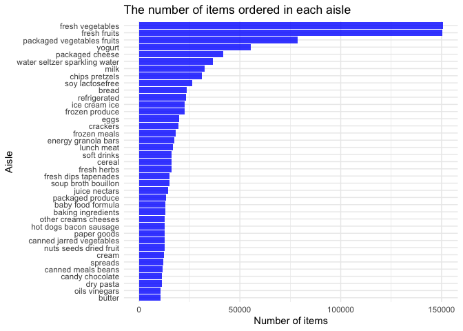

p8105\_hw3\_rz2570
================
Ruilian Zhang
10/12/2021

``` r
library(tidyverse)
```

    ## ── Attaching packages ─────────────────────────────────────── tidyverse 1.3.1 ──

    ## ✓ ggplot2 3.3.5     ✓ purrr   0.3.4
    ## ✓ tibble  3.1.4     ✓ dplyr   1.0.7
    ## ✓ tidyr   1.1.3     ✓ stringr 1.4.0
    ## ✓ readr   2.0.1     ✓ forcats 0.5.1

    ## ── Conflicts ────────────────────────────────────────── tidyverse_conflicts() ──
    ## x dplyr::filter() masks stats::filter()
    ## x dplyr::lag()    masks stats::lag()

``` r
library(p8105.datasets)

# Set plot options.

knitr::opts_chunk$set(
  fig.width = 6,
  fig.asp = .6,
  out.width = "90%"
)

theme_set(theme_minimal() + theme(legend.position = "bottom"))

options(
  ggplot2.continuous.colour = "viridis",
  ggplot2.continuous.fill = "viridis"
)

scale_colour_discrete = scale_colour_viridis_d
scale_fill_discrete = scale_fill_viridis_d
```

# Problem 1

``` r
# Import data and do some exploration.

data("instacart")

dim(instacart)
```

    ## [1] 1384617      15

``` r
names(instacart)
```

    ##  [1] "order_id"               "product_id"             "add_to_cart_order"     
    ##  [4] "reordered"              "user_id"                "eval_set"              
    ##  [7] "order_number"           "order_dow"              "order_hour_of_day"     
    ## [10] "days_since_prior_order" "product_name"           "aisle_id"              
    ## [13] "department_id"          "aisle"                  "department"

``` r
head(instacart) 
```

    ## # A tibble: 6 × 15
    ##   order_id product_id add_to_cart_order reordered user_id eval_set order_number
    ##      <int>      <int>             <int>     <int>   <int> <chr>           <int>
    ## 1        1      49302                 1         1  112108 train               4
    ## 2        1      11109                 2         1  112108 train               4
    ## 3        1      10246                 3         0  112108 train               4
    ## 4        1      49683                 4         0  112108 train               4
    ## 5        1      43633                 5         1  112108 train               4
    ## 6        1      13176                 6         0  112108 train               4
    ## # … with 8 more variables: order_dow <int>, order_hour_of_day <int>,
    ## #   days_since_prior_order <int>, product_name <chr>, aisle_id <int>,
    ## #   department_id <int>, aisle <chr>, department <chr>

-   The `instacart` dataframe has 15 of columns and 1384617 of
    observations. Each row contains relative information of an item from
    one order , which are: order\_id, product\_id, add\_to\_cart\_order,
    reordered, user\_id, eval\_set, order\_number, order\_dow,
    order\_hour\_of\_day, days\_since\_prior\_order, product\_name,
    aisle\_id, department\_id, aisle, department.  
-   For example, for product `49302`, its order of being added to cart
    was `1` by user `112108`, and it’s from `dairy eggs` department.

``` r
# How many aisles are there, and which aisles are the most items ordered from?

ins_aisle = instacart %>% 
  group_by(aisle) %>% 
  summarize(
    n_obs = n()) %>% 
  arrange(-n_obs)
```

-   There are 134 aisles, the `fresh vegetables` (`aisle_id` is 83)
    aisle is the most items are ordered from.

``` r
# Make a plot that shows the number of items ordered in each aisle, limiting this to aisles with more than 10000 items ordered.

ins_aisle %>% 
  filter(n_obs > 10000) %>% 
  mutate(aisle = forcats::fct_reorder(aisle, n_obs)) %>% 
  ggplot(aes(x = aisle, y = n_obs)) +
  geom_bar(stat = "identity", fill = "blue", alpha = .8) +
  coord_flip() +
  labs(
    title = "The number of items ordered in each aisle",
    x = "Aisle",
    y = "Number of items"
  )
```



``` r
# Make a table showing the three most popular items in each of the aisles “baking ingredients”, “dog food care”, and “packaged vegetables fruits”.

popular_items_table = instacart %>% 
  filter(aisle == c("baking ingredients", "dog food care", "packaged vegetables fruits")) %>% 
  group_by(aisle) %>% 
  summarize(order_times = n())

knitr::kable(popular_items_table)
```

| aisle                      | order\_times |
|:---------------------------|-------------:|
| baking ingredients         |         4391 |
| dog food care              |          528 |
| packaged vegetables fruits |        26420 |

``` r
# Make a table showing the mean hour of the day at which Pink Lady Apples and Coffee Ice Cream are ordered on each day of the week.

mean_hour_table = instacart %>% 
  filter(product_name == c("Pink Lady Apples", "Coffee Ice Cream")) %>%
  group_by(product_name, order_dow) %>% 
  summarize(mean_hour = mean(order_hour_of_day)) %>% 
  pivot_wider(names_from = order_dow,
              values_from = mean_hour) 
```

    ## `summarise()` has grouped output by 'product_name'. You can override using the `.groups` argument.

``` r
knitr::kable(mean_hour_table)
```

| product\_name    |        0 |        1 |        2 |       3 |        4 |        5 |        6 |
|:-----------------|---------:|---------:|---------:|--------:|---------:|---------:|---------:|
| Coffee Ice Cream | 13.22222 | 15.00000 | 15.33333 | 15.4000 | 15.16667 | 10.33333 | 12.35294 |
| Pink Lady Apples | 12.25000 | 11.67857 | 12.00000 | 13.9375 | 11.90909 | 13.86957 | 11.55556 |

# Problem 2

``` r
# load BRFSS data and do some cleaning

data("brfss_smart2010")

brfss_smart2010 = janitor::clean_names(brfss_smart2010) %>% 
  filter(topic == "Overall Health") %>% 
  mutate(response = factor(response)) %>% 
  mutate(reponse = forcats::fct_relevel(response, c("Poor", "Fair", "Good", "Very good", "Excellent"))) %>% 
  arrange(reponse)
```
